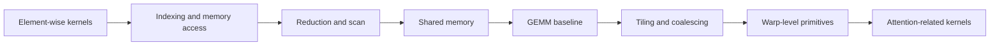

<div align="center">
  <h1>My CUDA Journey</h1>
  <p><strong>100 days, 50 CUDA kernels, with runnable code, notes, benchmarks, bugs, and weekly reviews.</strong></p>
  <p>
    
    
    
    
  </p>
</div>

## What This Repo Is

`My_CUDA_Journey` is a public CUDA learning and reproduction archive.

The goal is not to look like a complete tutorial from day one. The goal is to record a real path: write one kernel at a time, run it, measure it, explain it, document the bug, and turn the result into reusable notes for GitHub, Zhihu, CSDN, and Xiaohongshu.

Core promise:

> 100 天手撕 50 个 CUDA 算子，公开代码、手写笔记、实验环境、性能数据、失败记录和复盘结论。

## Contents

- [What This Repo Is](#what-this-repo-is)
- [Why This Exists](#why-this-exists)
- [Quick Start](#quick-start)
- [Learning Map](#learning-map)
- [Kernel Registry](#kernel-registry)
- [Benchmark Board](#benchmark-board)
- [Repository Structure](#repository-structure)
- [Content Pipeline](#content-pipeline)
- [Documentation Rules](#documentation-rules)
- [Contributing](#contributing)
- [What To Add Next](#what-to-add-next)
- [References](#references)

## Why This Exists

CUDA is hard for beginners because the execution model is invisible. A short code snippet often hides several questions:

- Which thread computes which element?
- Why does a 1D kernel become wrong when extended to 2D?
- What is actually measured in a benchmark?
- Why does a fast-looking result become meaningless without input shape, dtype, GPU, and timing method?
- How does a simple element-wise kernel lead toward GEMM and attention kernels?

This repo turns those questions into small, reproducible experiments.

## Quick Start

The first runnable kernel will live under `kernels/day001-vector-add/`.

```bash
# Example layout for Day 001. Update after the first kernel is committed.
cd kernels/day001-vector-add
nvcc -O2 vector_add.cu -o vector_add
./vector_add
```

Expected verification style:

```text
=== vector_add verification ===
Input size: 1048576
Max error : 0.000000e+00
Result    : PASS
```

Benchmark output should be stored in `benchmarks/day001-vector-add.csv` and summarized in this README only after it is reproducible.

## Learning Map



## Kernel Registry

Status legend:

- `Planned`: topic is in the roadmap.
- `Code`: CUDA code exists.
- `Verified`: correctness test passes.
- `Benchmarked`: benchmark data is recorded with environment and input shape.
- `Explained`: note and platform drafts are complete.

### Phase 1: Element-wise and Indexing

| Day | Kernel | Level | Status | Code | Note | Benchmark | Main concept |
|---:|---|---|---|---|---|---|---|
| 001 | Vector Add | Easy | Planned | `kernels/day001-vector-add/` | `notes/day001-vector-add.md` | `benchmarks/day001-vector-add.csv` | thread/block/grid |
| 002 | Matrix Add | Easy | Planned | `kernels/day002-matrix-add/` | `notes/day002-matrix-add.md` | - | 2D indexing |
| 003 | ReLU | Easy | Planned | `kernels/day003-relu/` | `notes/day003-relu.md` | - | element-wise pattern |
| 004 | Sigmoid | Easy | Planned | `kernels/day004-sigmoid/` | `notes/day004-sigmoid.md` | - | math functions |

### Phase 2: Reduction and Shared Memory

| Day | Kernel | Level | Status | Code | Note | Benchmark | Main concept |
|---:|---|---|---|---|---|---|---|
| 005 | Reduce Sum v1 | Medium | Planned | `kernels/day005-reduce-sum-v1/` | `notes/day005-reduce-sum-v1.md` | - | reduction baseline |
| 006 | Reduce Sum v2 | Medium | Planned | `kernels/day006-reduce-sum-v2/` | `notes/day006-reduce-sum-v2.md` | - | shared memory |
| 007 | Weekly Review 001 | Review | Planned | - | `notes/weekly-001.md` | - | bugs and lessons |

### Later Phases

| Phase | Topic | Goal |
|---|---|---|
| Phase 3 | GEMM baseline | Write naive SGEMM and understand memory traffic. |
| Phase 4 | GEMM optimization | Add tiling, shared memory, vectorized load, and coalescing. |
| Phase 5 | LLM-related kernels | Connect CUDA basics to RMSNorm, Softmax, RoPE, and attention. |

## Benchmark Board

No benchmark is accepted without environment, input shape, dtype, baseline, and timing method.

| Kernel | GPU | Input | DType | Baseline | Current | Notes |
|---|---|---:|---|---:|---:|---|
| Vector Add | TBD | TBD | TBD | TBD | TBD | Fill after Day 001 |

Use `ENVIRONMENT.md` for machine setup and `benchmarks/summary.csv` for raw tracking.

## Repository Structure

```text
My_CUDA_Journey/
├── README.md                    # Project homepage and public index
├── ROADMAP.md                   # 100-day learning path
├── ENVIRONMENT.md               # Hardware, CUDA, compiler, framework versions
├── PROGRESS.md                  # Daily progress table
├── kernels/                     # CUDA source code and per-kernel README files
├── notes/                       # Daily notes and weekly reviews
├── benchmarks/                  # Raw benchmark CSV files and summaries
├── bugs/                        # Build/runtime/debug records
├── images/                      # Handwritten notes, diagrams, screenshots
├── platform/                    # Zhihu, CSDN, Xiaohongshu drafts
│   ├── zhihu/
│   ├── csdn/
│   └── xiaohongshu/
├── docs/                        # Meta docs and README analysis
└── templates/                   # Reusable writing templates
```

## Content Pipeline

One kernel should produce multiple assets:

| Asset | Location | Purpose |
|---|---|---|
| CUDA source | `kernels/dayXXX-name/` | Reproducible code |
| Kernel README | `kernels/dayXXX-name/README.md` | Build, run, expected output |
| Daily note | `notes/dayXXX-name.md` | Personal understanding and bug notes |
| Benchmark | `benchmarks/dayXXX-name.csv` | Raw measurements |
| Bug record | `bugs/dayXXX-*.md` | Reproduction and fix |
| Zhihu draft | `platform/zhihu/` | Principle, tradeoff, learning reflection |
| CSDN draft | `platform/csdn/` | Engineering steps and error fixes |
| Xiaohongshu draft | `platform/xiaohongshu/` | Visual notes and progress story |

## Documentation Rules

1. No benchmark without hardware, input size, dtype, baseline, and timing method.
2. No copied tutorial without a personal experiment or reproduction record.
3. Every kernel should have a minimal build command and expected output.
4. Every failed run that blocks progress should be recorded in `bugs/`.
5. README tables should show facts only. Do not mark a kernel as verified before it actually passes.
6. Platform articles should link back to the GitHub evidence, but the article itself must still answer the reader's question.

## Contributing

See `CONTRIBUTING.md`.

The short version: add runnable code first, then notes, then benchmark data. Do not upgrade a status label before the evidence exists.

## What To Add Next

- `images/cover.png`: a clean visual cover for the repository and social posts.
- `kernels/day001-vector-add/`: first runnable CUDA example.
- `notes/weekly-001.md`: first weekly review.

## References

- [LeetCUDA](https://github.com/xlite-dev/LeetCUDA): strong README structure, kernel registry, quick start, benchmark presentation, and reference index.
- [NVIDIA CUDA C++ Programming Guide](https://docs.nvidia.com/cuda/cuda-c-programming-guide/)
- [NVIDIA CUDA C++ Best Practices Guide](https://docs.nvidia.com/cuda/cuda-c-best-practices-guide/)
